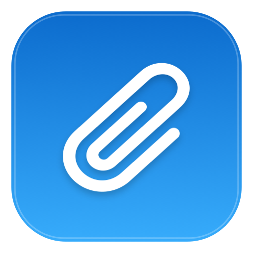
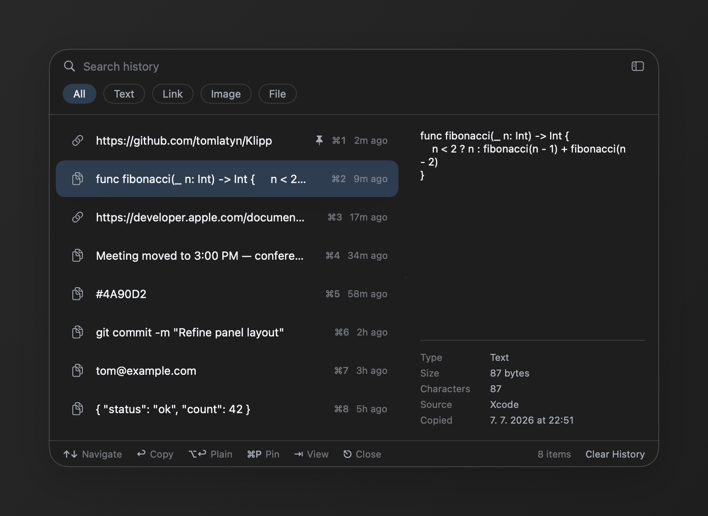

  

<h1 align="center">Klipp</h1>

  A lightweight macOS menu bar clipboard manager for text, links, images, and files.

  
  
  

  

---

## What is Klipp?

Klipp is a small macOS menu bar clipboard manager. It records copied text, links, images, and files, then brings them back with a global keyboard shortcut.

## Features

- Menu bar app with no Dock icon
- Global shortcut, default **Shift-Command-V**
- Keyboard-first history panel with search, type filters, and quick selection
- Compact and full panel modes with previews and metadata
- Automatic history cleanup after 1 day, 7 days, or 1 month
- Privacy-aware handling for concealed and transient clipboard content

## Requirements

- macOS 14.0 (Sonoma) or later

## Installation

1. Download the latest `.dmg` from the [Releases](../../releases) page.
2. Open the `.dmg` and drag **Klipp** into your Applications folder.
3. Launch Klipp from Applications — it will appear in your menu bar.
4. Use **Shift-Command-V** to open clipboard history from anywhere.

## Contributing

Contributions are welcome. Open an issue to discuss what you'd like to change, then submit a pull request.

## License

MIT — see [LICENSE](LICENSE).

---

Made by <a href="https://tomaslatyn.dev">Tomáš Latýn</a>

